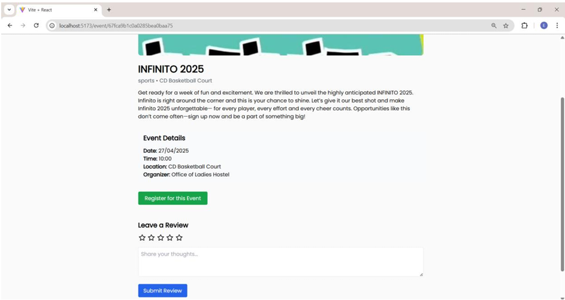
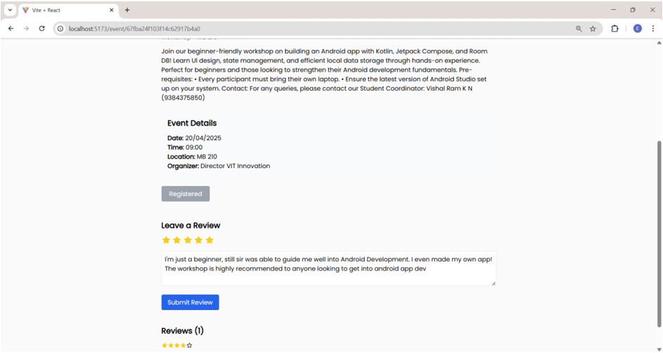
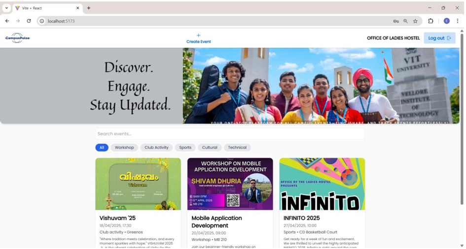

# Campus Events Knowledge System (CEKS)

> 🔔 A modified version of [Bilal025/EventoEMS](https://github.com/Bilal025/EventoEMS)  
> 🎓 Developed as part of an academic project for the course **Knowledge Management System**  

---

## 🎯 Project Description

**CEKS** is a centralized web-based platform that enables students and organizers to interact with campus-based events effectively. It was designed to address the limitations of fragmented event communication across student clubs, posters, and messaging groups. The system allows:

- 🔍 Students to search, filter, register, and review events.
- 🧑‍🏫 Organizers to create, update, and delete events.
- 🔐 Role-based login and access control for secure workflows.
- ⭐ Rating and feedback collection to promote knowledge reuse and reflection.

The system integrates **knowledge management principles** like knowledge creation (user reviews), knowledge sharing (searchable listings), and knowledge storage (event/user DB).

---

## 🛠️ Tech Stack

- **Frontend**: React.js + Tailwind CSS
- **Backend**: Node.js + Express.js
- **Database**: MongoDB Atlas
- **Authentication**: JWT with cookies
- **File Uploads**: Multer
- **Other Tools**: Postman, Visual Studio Code, GitHub

---

## 📸 Screenshots

> (Optional: You can add image files inside a `/screenshots/` folder in the repo and replace the filenames below)

### 🔐 Login Page


### 📝 SignUp Page


### 🎉 Home Page with Search and Filters


### 📄 Student View




### 📄 Event Organizer View



---

## 🚀 Features

| Feature                          | Description                                                  |
|----------------------------------|--------------------------------------------------------------|
| 🔐 Role-based Authentication     | Students and organizers have different privileges            |
| 📝 Event Creation (Organizers)  | Add event details, categories, image upload                  |
| 📅 Event Registration (Students) | One-click registration with duplicate prevention             |
| ⭐ Ratings & Reviews             | Students leave feedback visible to future participants       |
| 🔍 Search & Filter               | Search by title or filter by category                        |
| ✏️ Edit/Delete Event            | Organizers can manage event updates or cancelations          |
| 📱 Responsive UI                | Clean and mobile-friendly interface using Tailwind CSS       |

---

## 📖 How to Run the Project

> Ensure you have **Node.js**, **npm**, and a valid **MongoDB Atlas URI**.

### 🔧 Backend (server)

```bash
cd server
npm install
touch .env
# Add this inside .env file
MONGO_URL=<your_mongodb_uri>
npm start
```

### 💻 Frontend (client)

```bash
cd client
npm install
npm run dev
```

## 🔏 Disclaimer & License
This is a modified version of Bilal025/EventoEMS, adjusted for academic purposes only.
Credits for the original architecture and base design go to Bilal025.

We have made substantial changes including:

* UI and component structure redesign
* Full feature upgrades like role-based access and JWT login
* Ratings & review integration
* Organizer-only privileges and event editing
* Mobile responsiveness and code optimization

This fork is NOT for commercial use.
